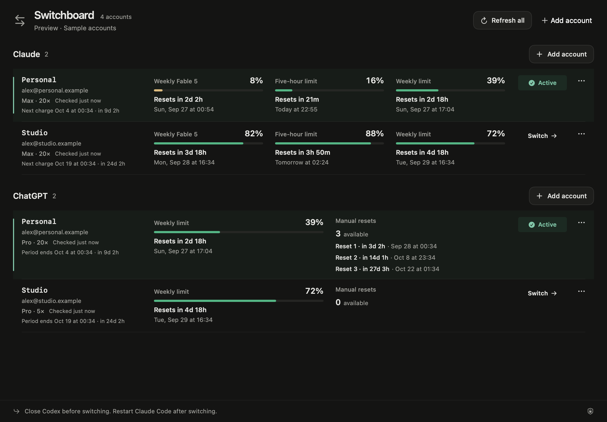

# Switchboard

**Your Claude Code and Codex accounts, together.**

A native Mac app to compare subscription limits, see reset times, and switch the account used by your next CLI session. Free software under the [MIT license](LICENSE).

[Download for Mac](https://switchboard.quasa0.com/#install) · [Website](https://switchboard.quasa0.com) · [Agent installation](https://switchboard.quasa0.com/install.md) · [Releases](https://github.com/quasa0/switchboard/releases)



## Install

Requires **macOS 14+**. The download supports **Apple silicon and Intel**. Install Claude Code or Codex for each provider you want to use.

1. [Download Switchboard 0.5.2](https://github.com/quasa0/switchboard/releases/download/v0.5.2/Switchboard-0.5.2-universal.dmg).
2. Open the DMG. Drag Switchboard into Applications.
3. Open Switchboard. This release is **ad hoc signed and not notarized**. If macOS blocks it, use **System Settings → Privacy & Security → Open Anyway** after your first open attempt, if you trust the download. [Apple explains this step](https://support.apple.com/en-us/102445).
4. Choose **Add account → Save current login**, or sign in through the app. Save each account before adding the next.

[ZIP download](https://github.com/quasa0/switchboard/releases/download/v0.5.2/Switchboard-0.5.2-universal.zip) · [SHA-256 checksums](https://github.com/quasa0/switchboard/releases/download/v0.5.2/SHA256SUMS.txt)

For a coding agent, paste: **Install Switchboard on this Mac. Read https://switchboard.quasa0.com/install.md and follow the steps. Verify the checksum and preserve existing credentials.**

## What it does

- Shows Claude and ChatGPT subscription accounts on one screen, with a separate active account for each provider.
- Displays remaining allowance, plan tiers, reset countdowns, and exact local dates. Claude includes Fable and other reported model limits.
- Shows Codex manual reset credits and their expiry dates when supplied by the provider. It does not redeem credits.
- Reads available subscription period dates. Claude billing dates use an optional, separate web sign-in. Manual overrides remain available.
- Saves login snapshots in macOS Keychain. Uses the official CLIs for authentication and usage, without a proxy or model prompt.

**Close the provider’s running sessions before switching.** Select another account, then start a fresh Claude Code or Codex session. Switchboard does not change browser logins or migrate running conversations.

The ChatGPT section shows **Codex allowances**, not ChatGPT message quotas. Missing usage stays unavailable; errors preserve the previous snapshot with a warning. Internal provider interfaces can change.

## Build from source

Requires Swift 5.10+ through Xcode Command Line Tools. No Swift package dependencies.

```sh
git clone https://github.com/quasa0/switchboard.git
cd switchboard
./scripts/install.sh
```

This installs `~/Applications/Switchboard.app`. Quit Switchboard before installing an update. Local builds use an available Apple Development identity, or ad hoc signing. Set `SWITCHBOARD_SIGNING_IDENTITY=-` to explicitly use ad hoc signing. Public release packaging always uses ad hoc signing and does not include a personal development certificate.

## Develop and verify

```sh
swift test
node scripts/test-billing-reader.mjs
python3 scripts/check-site.py
SWITCHBOARD_SIGNING_IDENTITY=- ./scripts/build.sh
./scripts/ui-smoke.sh dist/Switchboard.app
```

These checks use synthetic accounts. They do not read real logins or exercise Keychain. Open `.build/debug/Switchboard --demo` for an interactive preview; quit with ⌘Q. The separate `scripts/smoke.sh` credential test **does** write synthetic secrets to temporary Keychain namespaces and may trigger system prompts. Run it only when testing credential storage intentionally.

## Documentation

- [User guide](docs/usage.md): add accounts, switch, connect billing, and interpret tiers.
- [Architecture and compatibility](docs/architecture.md): storage, rollback, protocol details, and freshness limits.
- [Contributing](CONTRIBUTING.md): structure, checks, and issue reports.
- [Security policy](SECURITY.md): sensitive data and private vulnerability reporting.
- [Releasing](docs/releasing.md): universal packages, checksums, and website deployment.
- [Changelog](CHANGELOG.md).

The website adapts the owner’s FastClip landing design. It uses a self-hosted Geist font under the [SIL Open Font License](site/fonts/OFL.txt). The app and remaining repository code are MIT licensed. Switchboard is an independent project, not affiliated with Anthropic or OpenAI.
